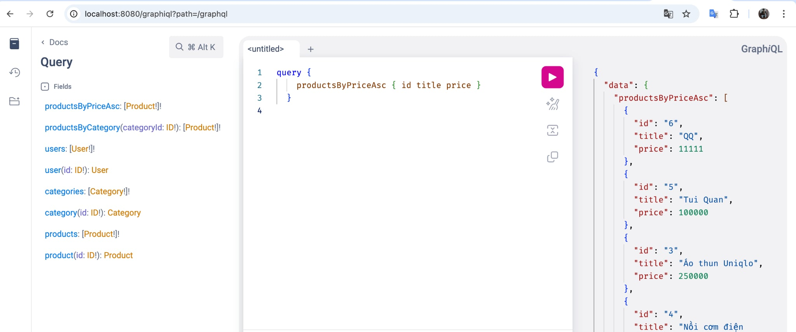
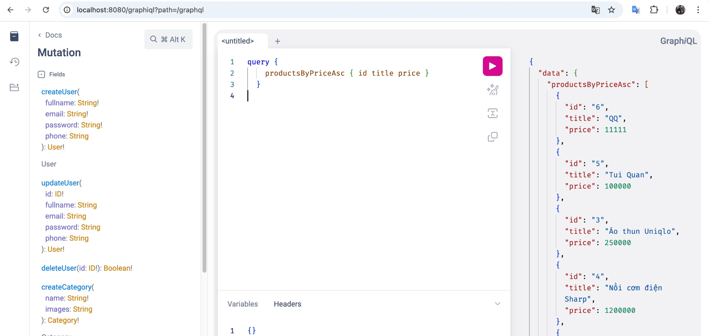
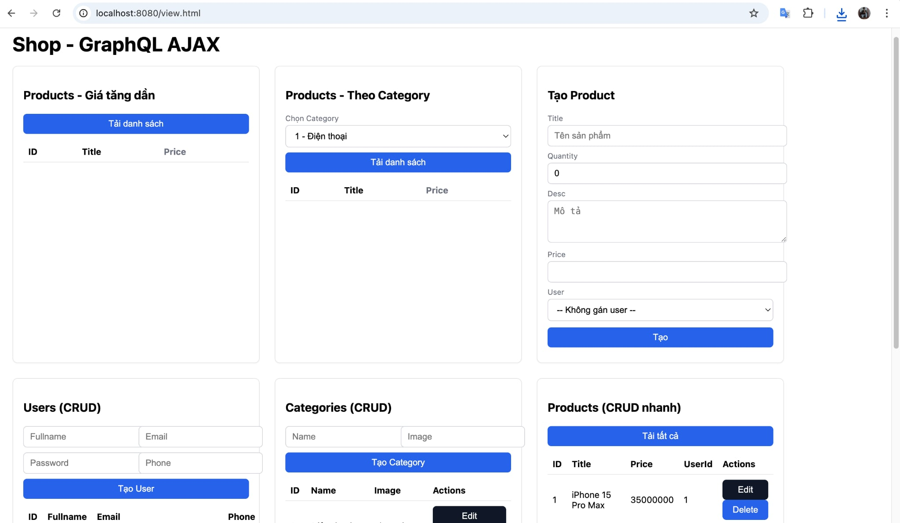

# GraphQL_BaiTap08

Spring Boot 3 + GraphQL + JPA (MySQL)

- Hiển thị tất cả product theo price tăng dần
- Lấy tất cả product của 1 category
- CRUD User / Category / Product (GraphQL + AJAX)

- GraphiQL: `http://localhost:8080/graphiql`
- View (AJAX): `http://localhost:8080/view.html`

## GraphQL
Schema: `src/main/resources/graphql/schema.graphqls`

Ví dụ:

```graphql
query { productsByPriceAsc { id title price } }

query($categoryId: ID!) { productsByCategory(categoryId: $categoryId) { id title price } }

mutation { createProduct(title: "Test", quantity: 3, desc: "desc", price: 1000000, userId: 1) { id title } }
```

## Frontend (AJAX)
`src/main/resources/static/view.html` dùng `fetch('/graphql')` để render:
- Danh sách sản phẩm theo giá tăng dần
- Lọc theo category (dropdown)
- CRUD User/Category/Product




